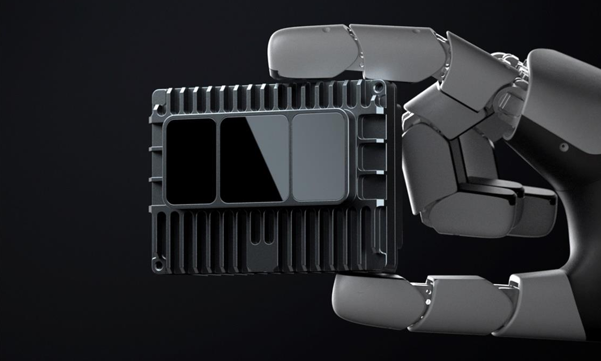
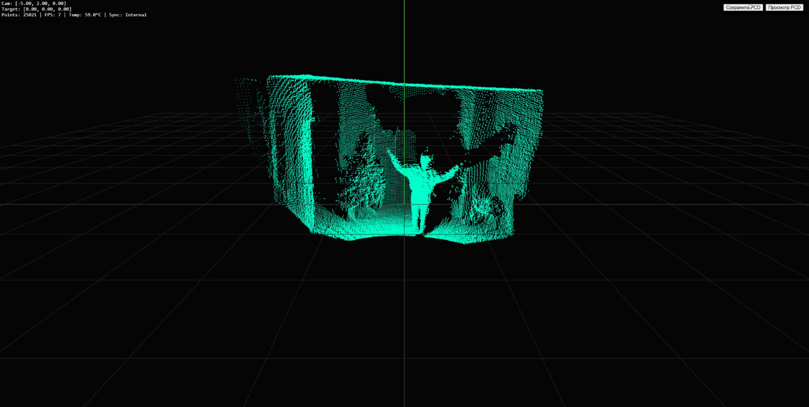
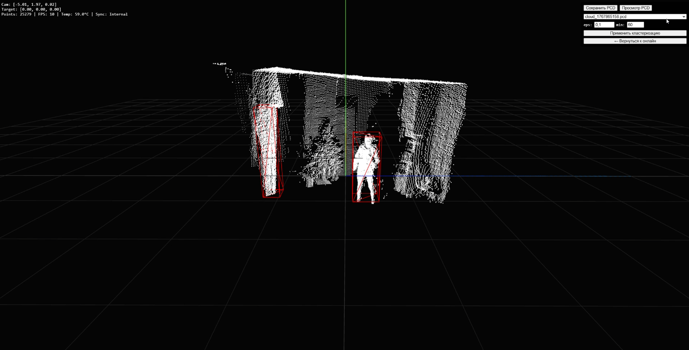

# WebViewer для LiDAR E1R

## Описание
Веб-приложение для онлайн-визуализации, сохранения, просмотра и кластеризации облаков точек с твердотельного LiDAR E1R.
Позволяет работать как в реальном времени, так и с сохранёнными .pcd-файлами, выделяя объекты методом DBSCAN и отображая их с цветовой разметкой и боксами.

## Пример


## Технологии
- Backend: Python, Flask, Flask-SocketIO, Open3D, NumPy
- Frontend: HTML5, Three.js, Socket.IO Client
- LiDAR: Solid-State LiDAR E1R (протокол MSOP)

## Быстрый запуск
### Установите зависимости
``` pip install flask flask-socketio open3d numpy ```

### Запустите сервер
``` python app.py ```

### Перейдите по адресу:
- [http://localhost:5000](http://localhost:5000)

## Подбор параметров кластеризации
- eps - Макс. расстояние между точками в одном кластере
- min_points - Мин. число точек для формирования кластера

## Структура проекта
```bash
lidar-e1r-viewer/
├── app.py                 # основной сервер
├── saved_pcds/            # папка для сохранённых .pcd (создаётся автоматически)
└── static/
    └── index.html         # веб-интерфейс
```
## Используемое оборудование
В данном проекте используется лидар **RoboSense E1R** — полностью твердотельный цифровой лидар нового поколения с полем зрения 120°×90°, разработанный для робототехнических и навигационных приложений.

- **Производитель**: [RoboSense](https://www.robosense.ai/)
- **Модель**: [E1R](https://www.robosense.ai/en/rslidar/E1R)
- **Основные характеристики**:
  - Поле зрения (FOV): 120° × 90°
  - Дальность: до 75 м (30 м при 10% отражательной способности)
  - Частота генерации точек: до 260 000 точек/с
  - Архитектура: SPAD-SoC, 2D VCSEL, электронное сканирование
